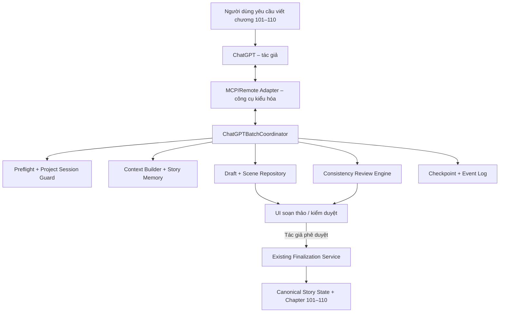
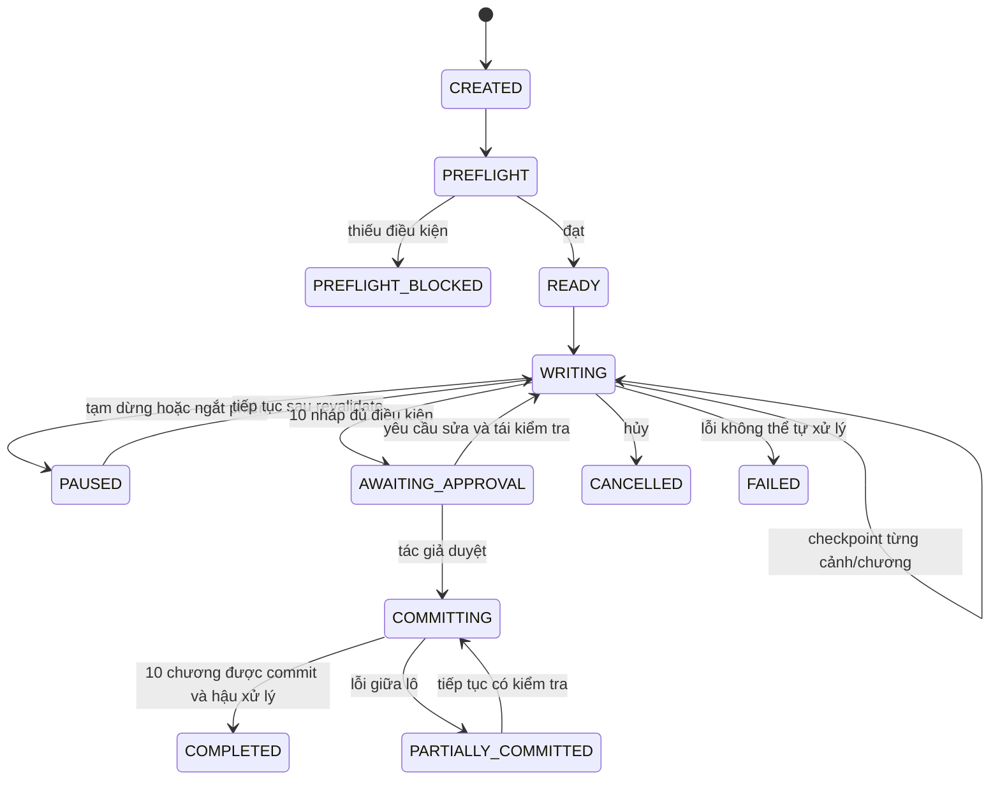

# SSR-viet truyen — Đặc tả ChatGPT Batch Writing

- **Mã đặc tả:** ANW-VN-BATCH-001
- **Phiên bản:** 1.0 (đề xuất thiết kế, chưa triển khai)
- **Ngày:** 2026-10-08
- **Cơ sở khảo sát:** `EthanYoQ/AI-Novel-Writer` bản `1.1.0`, đối chiếu các tệp trên nhánh mặc định; khi lập PR phải khóa lại SHA upstream thực tế.
- **Chủ thể sáng tác:** ChatGPT trong cuộc hội thoại do tác giả khởi xướng. Không đồng nhất ChatGPT subscription với OpenAI API.
- **Định hướng:** local-first, human-in-the-loop, lưu nháp bền vững, khôi phục sau gián đoạn.

## 1. Mục tiêu và phạm vi

### 1.1 Cấu hình nghiệm thu chuẩn

| Trường | Giá trị |
|---|---|
| `startChapter` | `101` |
| `chapterCount` | `10` |
| `endChapter` | `110` (tính toán, không nhập riêng) |
| `targetVisibleWordsPerChapter` | `2500` |
| `writingLanguage` | `vi-VN` |
| `authoringProvider` | `chatgpt_interactive` |
| `completionMode` | `draft_review` — không cho `auto_finalize` |
| `groupSize` | `2` chương / đợt, 5 đợt |
| `sceneChunkTargetWords` | khoảng 600–900 đơn vị từ / cảnh, có thể chỉnh |
| `lengthSoftBand` | 90%–110% so với mục tiêu, cảnh báo, không tự bịa nội dung để đủ số |
| `finalization` | duyệt thủ công từng chương hoặc cả lô; riêng commit luôn kiểm tra từng chương |

**Kết quả mong đợi:** từ chương 101 đến 110 có bản nháp có phiên bản, bằng chứng kiểm tra và checkpoint; trạng thái *finalized* không thay đổi nếu chưa có phê duyệt hợp lệ của tác giả. Lượt chạy không phụ thuộc toàn bộ 25.000 từ phải vừa một phản hồi ChatGPT duy nhất.

### 1.2 Ngoài phạm vi của bản đầu

- Không tự động gọi mô hình ChatGPT khi cuộc hội thoại kết thúc; ChatGPT không phải daemon nền của ứng dụng.
- Không tự tạo bản thảo nếu thiếu ChatGPT đã được người dùng chủ động gọi hoặc một provider API được cấu hình riêng.
- Không thay tất cả luồng sáng tác của AI Novel Writer gốc; thêm đường tích hợp rõ ràng và sử dụng lại lưu trữ/review/finalize sẵn có.
- Không đảm bảo kết quả đúng 2.500 từ, logic hoàn hảo hay nội dung không bị chính sách nhà cung cấp giới hạn.
- Không tự duyệt, tự ghi chính thức, tự sửa các quy tắc do tác giả khóa.

## 2. Thẩm định mã nguồn nền tảng

Cần kiểm lại tại chính commit làm việc; các điểm đã xác minh trên nhánh mặc định:

- `src/services/workflows/batch-chapter-workflow.ts`: `MIN_BATCH_CHAPTERS=1`, `MAX_BATCH_CHAPTERS=10`, chế độ `draft_review|auto_finalize`, `startChapterNumber`, `chapterCount`, `chapterWordsTarget`, `generationModelId`, `projectSession`. Đường `draft_review` lưu `draftId`, `version` và cung cấp các *candidate draft* trước đó làm ngữ cảnh.
- `src/services/workflows/chapter-materials.ts`: có `SelectedCandidateDraft`, `FinalizedMaterialSource`, `ChapterMaterialOmission`; tài liệu có nguồn và giới hạn ngữ cảnh. Các bản nháp chưa duyệt phải tiếp tục mang nhãn candidate.
- `src/services/workflows/commands/generate-draft.command.ts`: định danh bản nháp, phiên bản, câu lệnh lưu bản thảo.
- `src/services/workflows/commands/finalize-chapter.command.ts`: thao tác định稿, hậu xử lý và trạng thái tiếp nối.
- `src/stores/workflow-store.ts`: session lease, tài nguyên khóa đồng thời, trạng thái đang chạy/tạm dừng; không được mặc định đây là checkpoint bền vững cho một *ChatGPT-controlled batch*.
- `src/services/agent/tools/index.ts`: các tool đọc cấu trúc, nhân vật, bản nháp, tìm kiếm và thao tác sửa có kiểm soát.
- `electron/mcp/mcp-manager.ts` và `electron/mcp/mcp-ipc-bridge.ts`: hiện thiên về **MCP client**, ứng dụng gọi server bên ngoài; không chứng minh có sẵn server công khai để ChatGPT điều khiển ứng dụng.

**Quyết định kiến trúc:** tái sử dụng các dịch vụ thực sự có sẵn sau khi kiểm chứng; thêm `ChatGPTBatchCoordinator` và lớp công cụ MCP/Remote Desktop adapter. Tuyệt đối không gọi thẳng `FinalizeChapterCommand` theo lối thiếu kiểm soát người dùng hoặc ghi SQLite trực tiếp từ ChatGPT.

## 3. Hai phương án vận hành — một hợp đồng dữ liệu

### 3.1 Chế độ A: ChatGPT trong hội thoại (ưu tiên yêu cầu hiện tại)

1. Người dùng trong ChatGPT yêu cầu viết chương 101–110.
2. ChatGPT gọi công cụ đọc (`prepare_next`, `read_context`) qua cầu nối đang có quyền sử dụng.
3. ChatGPT tạo nội dung cảnh/chương bằng chính mô hình hội thoại.
4. ChatGPT gọi `append_scene`/`submit_draft` để phần mềm lưu bền vững.
5. Công cụ trả `checkpointId`, `draftId`, `version`, `contentHash` và nhiệm vụ tiếp theo.
6. Khi phản hồi hoặc phiên làm việc bị ngắt, người dùng yêu cầu “Tiếp tục lô 101–110”; công cụ trả đúng checkpoint chờ xử lý.
7. Khi đủ 10 bản nháp, ChatGPT có thể thực hiện lượt rà soát; **phải chờ người dùng duyệt trong ứng dụng hoặc một hành động xác nhận được chứng thực**.

**Không phụ thuộc API tính phí**, nhưng bị giới hạn bởi khả năng ChatGPT thực sự gọi công cụ ghi trong tài khoản/cấu hình đang dùng, độ dài lần phản hồi và số lượt công cụ. Không hứa chạy nền hoặc hoàn thành 10 chương hoàn toàn không tương tác.

### 3.2 Chế độ B: provider API tự động — tùy chọn về sau

Ứng dụng gọi provider API riêng đã được người dùng cấu hình để chạy quy trình mà không cần cuộc hội thoại ChatGPT đang mở. Hợp đồng dữ liệu (`BatchRun`, `BatchChapter`, checkpoint, review, approval) giống chế độ A; chỉ khác bộ tạo văn bản. API có phí riêng, không bao gồm trong ChatGPT Plus.

### 3.3 Đường kết nối

- **Giai đoạn khả thi ngay:** ChatGPT + Remote Desktop Commander, giới hạn ở giao tiếp qua adapter/trình CLI an toàn của SSR-viet truyen và các tệp đã cho phép. Không cho ChatGPT chỉnh DB tùy ý hoặc chạy thao tác phá hủy.
- **Đường mục tiêu:** `ChatGPT ↔ custom MCP server ↔ local bridge ↔ service layer SSR-viet truyen`. Server bên ngoài cần giải pháp kết nối hỗ trợ (ví dụ Secure MCP Tunnel), xác thực và quyền ghi tùy gói/workspace. MCP nội bộ của upstream là phía **client**, vì vậy phải thêm phía **server**.
- Một server MCP nên trình bày công cụ có kiểu và quyền rõ, không đặt một tool chạy shell tổng quát cho mọi thứ.

## 4. Kiến trúc các lớp



### 4.1 Các module dự kiến

| Module | Trách nhiệm | Bất biến |
|---|---|---|
| `BatchRunCoordinator` | Khởi chạy, khóa cấu hình, tuần tự các chương, tạm dừng/tiếp tục | Không chạy trùng cùng chương/dự án |
| `PreflightService` | Kiểm tra 100 đã chốt, blueprint 101–110, chương trùng, phiên bản, quyền | Block nếu thiếu điều kiện cần |
| `StoryContextBuilder` | Tạo context pack có nguồn, ngân sách tokens, missing evidence | Không biến kế hoạch thành dữ kiện chính thức |
| `SceneAssembler` | Nhận từng cảnh, ghép theo thứ tự, đếm từ | Chunks nguyên vẹn, không trùng/lệch thứ tự |
| `DraftPersistenceAdapter` | Ghi bản nháp qua repository/IPC nội bộ, version/hash | Không ghi đè nháp do người chỉnh |
| `ConsistencyReviewService` | Kiểm tra bất biến cứng + đề xuất mềm | Lỗi nghiêm trọng buộc xét duyệt, không tự sửa canon |
| `BatchCheckpointRepository` | Lưu trạng thái sau mỗi bước, nhật ký sự kiện | Đọc lại được sau restart, idempotent |
| `AuthorApprovalService` | Xác minh quyền, bản nháp hiện tại và cú bấm duyệt | ChatGPT không tự giả mạo phê duyệt |
| `FinalizationAdapter` | Dùng luồng định稿 gốc, theo dõi postprocess | Mỗi chương commit một lần hoặc xử lý idempotent |
| `MCPToolServer` | Tool đọc/ghi hạn quyền + xác thực | Không xuất key/path ngoài whitelist |

## 5. Luồng chi tiết từ chương 101 đến 110

### 5.1 Preflight bắt buộc

- Mở đúng `projectId`/`projectSession` đã khóa, `writingLanguage=vi-VN` (không suy từ UI locale).
- Kiểm tra chương 100 là mốc nguồn chính thức, hoặc có *base anchor* hợp lệ được tác giả chọn rõ. Không tự giả định chương 100 đã tồn tại.
- Kiểm tra 101–110 có blueprint; nếu thiếu thì yêu cầu lập và duyệt blueprint trước khi viết. Phát hiện chương 101–110 đã có bản nháp hoặc final; **không ghi đè**.
- Khóa `storyBibleRevision`, `canonicalHeadRevision`, `blueprintRevisions`, `writingPolicyRevision`, `modelMode` và người tạo phiên. Chỉ lưu tham chiếu/phiên bản, không sao chép key API.
- Đánh giá giới hạn cửa sổ ngữ cảnh, rủi ro ảnh hưởng tới các chương sau, quyền của MCP tool. Nếu thiếu thông tin bắt buộc → `PREFLIGHT_BLOCKED` cùng lỗi có thể xử lý.

### 5.2 Phân chia công việc

| Đợt | Chương | Điều kiện vào | Checkpoint sau đợt |
|---|---|---|---|
| 1 | 101–102 | Canonical tới 100; blueprint 101–102 | 101 và 102 saved/reviewed |
| 2 | 103–104 | Có nháp 101–102, đọc như **candidate** | 103 và 104 saved/reviewed |
| 3 | 105–106 | Có nháp trước, kiểm chứng quan hệ, timeline | 105 và 106 saved/reviewed |
| 4 | 107–108 | Đọc biến động nhân vật trong lô | 107 và 108 saved/reviewed |
| 5 | 109–110 | Kiểm tra các nút thắt, nhịp và điểm kết lô | 109 và 110 saved/reviewed |

`groupSize=2` là cách trình bày tiến độ; về thực thi **mỗi chương có checkpoint độc lập**. Khi yêu cầu 2 chương vượt giới hạn phản hồi, tiếp tục bằng từng cảnh hoặc một chương, tuyệt đối không phụ thuộc một câu trả lời chứa cả 5.000 từ.

### 5.3 Mỗi chương được viết qua các cảnh

1. `prepare_next_chapter`: khóa context, liệt kê mục tiêu, nhân vật, giới hạn, bằng chứng và cảnh báo thiếu nguồn.
2. `begin_chapter`: cấp `chapterAttemptId`, `contextHash`, `nextSceneIndex=1`.
3. ChatGPT sáng tác cảnh theo thứ tự, thông thường 600–900 từ mỗi cảnh (không ép cứng).
4. `append_scene`: kiểm tra `attemptId`, `sceneIndex`, `idempotencyKey`, text và hash; lưu atomic, trả số từ tích lũy; nếu retry với key giống nhau thì trả cùng biên nhận.
5. `submit_draft`: kết thúc, kiểm tra thiếu cảnh, đếm từ (nếu ngoài 90–110% thì cảnh báo/đề xuất mở rộng, không tự gửi bản lỗi thành final), chuẩn hóa Unicode an toàn, lưu bản nháp có version.
6. `review_chapter`: kiểm tra bất biến có chứng cứ; lưu review report và trạng thái `READY_FOR_APPROVAL` hoặc `NEEDS_REVISION`.
7. Sau mỗi bước quan trọng, ghi `batch_event` và checkpoint. Chỉ cho phép chuyển sang chương sau khi chương trước có **nháp đã lưu**; chưa cần final.

Nếu review phát hiện lỗi, tác giả hoặc ChatGPT có thể tạo phiên bản nháp mới. Các chương sau phụ thuộc bản nháp cũ cần đánh dấu `STALE_DEPENDENCY` và kiểm tra lại trước khi duyệt.

## 6. Hệ thống bộ nhớ và xây dựng ngữ cảnh

### 6.1 Thứ tự ưu tiên sự thật

1. **Quy tắc và dữ kiện tác giả đã xác nhận:** bối cảnh nền, quy luật thế giới, điều cấm, tính cách và danh xưng được khóa.
2. **Chương đã định稿:** có chapterId, version/hash và đoạn trích cụ thể.
3. **Sự kiện đã được duyệt:** bản ghi dẫn tới trích đoạn chính thức; có trạng thái thời gian.
4. **Blueprint/kế hoạch tương lai:** chỉ định hướng, không được coi đã xảy ra.
5. **Candidate draft chương 101–110:** ngữ cảnh nối chương nhưng vẫn *chưa phải canon*.
6. **Bản tóm tắt / suy đoán do AI tạo:** tài liệu tìm kiếm có thể sai, luôn cần nguồn gốc.

Nếu nguồn mâu thuẫn, không tự lựa chọn phiên bản “có vẻ hợp lý”; tạo conflict report và chặn khi ảnh hưởng đến bất biến cốt truyện.

### 6.2 `StoryContextPack` đầu vào mỗi chương

- Dàn ý tổng thể / quyển / arc / blueprint chương hiện tại.
- Những luật thế giới, hệ thống sức mạnh, giọng văn, tuyến quan hệ liên quan trực tiếp.
- Trạng thái nhân vật *tại thời điểm ngay trước chương đang viết*, bao gồm item/địa điểm/thương tích/kiến thức đã biết.
- Dòng thời gian và các sự kiện liên quan đã finalized.
- Các tình tiết gieo trước cần trả lời hoặc cố tình hoãn, trạng thái `open|resolved|deferred`.
- Kết thúc chương liền trước; nếu chương liền trước nằm trong lô thì nhãn `candidate`.
- Danh mục nguồn trích `sourceId`, `chapter`, `textHash`, `quoteRange`, `status`, `confidence`.
- `omissions[]`: nguồn không tìm thấy, tài liệu bị cắt vì ngân sách, nguồn lỗi/hết hạn. Thiếu dữ kiện trọng yếu thì dừng yêu cầu người dùng quyết định.

**Ngân sách:** context builder dùng token budget của host/provider nếu biết. Không lấy số ký tự hoặc số “từ tiếng Việt” thay cho token. Có phân bổ ưu tiên: author locks / canon / blueprint / bản nháp liền trước / hồi cố có chứng cứ. Tất cả cắt bỏ phải xuất `omissions` để kiểm thử.

### 6.3 Bộ nhớ sau một lô nháp

- **Candidate ledger:** sự kiện, quan hệ, tiết lộ, vật phẩm, thay đổi trạng thái dựa vào bản nháp chưa duyệt; dán `candidate_batch_run_id`.
- **Canonical ledger:** chỉ nhận facts sau khi chương được duyệt và `FinalizationAdapter` hoàn tất.
- Nếu chỉnh hoặc bỏ bản nháp chương 104, candidate derived của 105–110 phải bị đánh dấu cần kiểm tra lại; không âm thầm cập nhật canon.

## 7. State machine và checkpoint

### 7.1 Trạng thái BatchRun



Phê duyệt cả lô là một quyết định UX. Vì hệ thống upstream chốt **từng chương kèm hậu xử lý**, không giả định toàn bộ 10 chương là một SQLite transaction nguyên khối. Nếu chương 107 commit lỗi, 101–106 đã commit hợp lệ phải giữ nguyên, báo `PARTIALLY_COMMITTED`, không nhận 107–110 là thành công.

### 7.2 Trạng thái BatchChapter

`PENDING → CONTEXT_FROZEN → DRAFTING → DRAFT_SAVED → REVIEWING → READY_FOR_APPROVAL | NEEDS_REVISION → APPROVED → FINALIZING → FINALIZED`.

Có trạng thái phụ `STALE_CONTEXT`, `STALE_DEPENDENCY`, `FAILED` hoặc `SKIPPED` với nguyên nhân và hành động phục hồi. Không có cung trực tiếp từ `DRAFT_SAVED` sang `FINALIZED`.

### 7.3 Checkpoint bắt buộc lưu sau mỗi cảnh/chương/review

```json
{
  "schemaVersion": 1,
  "runId": "batch-uuid",
  "projectId": "project-uuid",
  "chapterRange": [101, 110],
  "chapterTargetWords": 2500,
  "completionMode": "draft_review",
  "authoringProvider": "chatgpt_interactive",
  "state": "WRITING",
  "nextChapter": 104,
  "nextSceneIndex": 2,
  "baseCanonicalRevision": "sha256:...",
  "storyBibleRevision": "sha256:...",
  "outlineRevision": "sha256:...",
  "chapterRecords": [
    { "chapter": 101, "draftId": 123, "version": 1, "contentHash": "sha256:...", "status": "READY_FOR_APPROVAL" }
  ],
  "contextHash": "sha256:...",
  "eventSequence": 19,
  "checkpointRevision": 20,
  "updatedAt": "2026-10-08T14:30:00Z"
}
```

`...` chỉ là ký hiệu minh họa, không phải giá trị kiểm chứng. Khi triển khai phải dùng SHA-256 thực. Checkpoint cần được lưu vào DB/app data và có phương án sao lưu, không phụ thuộc state React, lịch sử chat hay tệp JSON viết dở.

### 7.4 Khôi phục sau crash/ngắt phiên

1. Người dùng nói “Tiếp tục lô 101–110” hoặc nhấn “Tiếp tục”.
2. `get_batch_status` tải snapshot + event log, kiểm tra bản nháp, hash, status và khóa truy cập project.
3. Đối chiếu canonical/story bible/blueprint hiện tại với bản đã khóa; nếu đổi thì `REBASE_REQUIRED`, hỏi cách xử lý, không tiếp tục với context lỗi thời.
4. Xác định cảnh cuối cùng đã **lưu thành công** và đoạn đang chờ; yêu cầu ChatGPT viết từ đó, không lặp đoạn đã lưu.
5. Bản nháp đã hoàn tất không được tạo lại nếu không có yêu cầu **revision** riêng. Gửi lại cùng idempotencyKey phải trả đúng biên nhận cũ.

## 8. Hợp đồng lưu trữ đề xuất

Ưu tiên migrate **trong DB dự án hiện hữu** bằng migration có version, sao lưu và test; không phát sinh một DB cạnh tranh độc lập với draft repository của upstream.

```sql
CREATE TABLE chatgpt_batch_runs (
  run_id TEXT PRIMARY KEY,
  project_id TEXT NOT NULL,
  start_chapter INTEGER NOT NULL,
  chapter_count INTEGER NOT NULL CHECK (chapter_count BETWEEN 1 AND 10),
  chapter_target_words INTEGER NOT NULL CHECK (chapter_target_words > 0),
  writing_language TEXT NOT NULL,
  authoring_provider TEXT NOT NULL,
  completion_mode TEXT NOT NULL CHECK (completion_mode = 'draft_review'),
  frozen_baseline_json TEXT NOT NULL,
  status TEXT NOT NULL,
  revision INTEGER NOT NULL DEFAULT 0,
  created_at TEXT NOT NULL,
  updated_at TEXT NOT NULL
);

CREATE TABLE chatgpt_batch_chapters (
  run_id TEXT NOT NULL,
  chapter_number INTEGER NOT NULL,
  status TEXT NOT NULL,
  draft_id INTEGER,
  draft_version INTEGER,
  draft_sha256 TEXT,
  context_sha256 TEXT,
  dependency_hashes_json TEXT NOT NULL DEFAULT '{}',
  review_ref TEXT,
  approved_sha256 TEXT,
  approved_by TEXT,
  finalized_ref TEXT,
  updated_at TEXT NOT NULL,
  PRIMARY KEY (run_id, chapter_number),
  FOREIGN KEY (run_id) REFERENCES chatgpt_batch_runs(run_id)
);

CREATE TABLE chatgpt_batch_events (
  event_id TEXT PRIMARY KEY,
  run_id TEXT NOT NULL,
  sequence INTEGER NOT NULL,
  event_type TEXT NOT NULL,
  chapter_number INTEGER,
  idempotency_key TEXT,
  payload_json TEXT NOT NULL,
  created_at TEXT NOT NULL,
  UNIQUE (run_id, sequence),
  UNIQUE (run_id, idempotency_key),
  FOREIGN KEY (run_id) REFERENCES chatgpt_batch_runs(run_id)
);
```

Đây là **DDL định hướng**, phải sửa theo naming, migration, FK và repository thực tế sau khi checkout source. Bảng cảnh/chunk có thể dùng cùng draft store hoặc bảng riêng `chatgpt_batch_scenes` với `(run_id, chapter_number, attempt_id, scene_index)` UNIQUE; cần lưu text và content hash trong transaction trước khi gửi ACK. `idempotency_key` phải có namespace theo action + run; cần cho phép event thường không có key nhưng các hành động ghi bắt buộc key.

Thao tác ghi: verify expected revision → begin DB transaction → ghi scene/draft + event + increment revision → commit → trả receipt. Crash giữa request: client đọc trạng thái bằng idempotencyKey thay vì gửi thêm bản sao.

## 9. MCP tool contract — API hướng ChatGPT

MCP server là **dự kiến cần xây dựng**, không phải tính năng đã có trong bản phát hành upstream. Định nghĩa tool descriptions cho AI rõ khi nào dùng; tool đọc có `readOnlyHint` và tool ghi yêu cầu xác nhận theo môi trường.

| Tool | Quyền | Input cốt lõi | Output |
|---|---|---|---|
| `novel_batch_create` | Ghi cấu hình | `projectId`, `startChapter`, `count`, `targetWords`, `groupSize`, `clientRequestId` | `runId`, `preflight`, `revision` |
| `novel_batch_get_status` | Đọc | `runId` | state, chapters, nextStep, violations |
| `novel_batch_prepare_next` | Đọc | `runId`, `expectedRevision` | `chapter`, contextPack, evidence, omissions, `contextHash` |
| `novel_batch_append_scene` | Ghi nháp | `runId`, `chapter`, `attemptId`, `sceneIndex`, `text`, `contextHash`, `idempotencyKey` | durable receipt, nextIndex, wordCount |
| `novel_batch_submit_draft` | Ghi nháp | `runId`, `chapter`, `attemptId`, `expectedRevision`, `idempotencyKey` | `draftId`, `draftVersion`, `sha256`, wordCount |
| `novel_batch_review` | Đọc + ghi báo cáo | `runId`, `chapter`, `draftSha256`, `idempotencyKey` | findings, `reviewRef`, hardBlocking |
| `novel_batch_get_review` | Đọc | `runId`, `chapter` | review evidence, sửa đề xuất |
| `novel_batch_request_approval` | Ghi yêu cầu | `runId`, `draftSha256[]` | token/trạng thái yêu cầu trong app, **không tự phê duyệt** |
| `novel_batch_revise_draft` | Ghi nháp mới | `runId`, `chapter`, `expectedDraftSha256`, `changeRequest`, `idempotencyKey` | phiên bản nháp mới; stale downstream |
| `novel_batch_commit_approved` | Ghi canonical | `runId`, `approvedSnapshotRef`, `expectedRevision`, `idempotencyKey` | commit receipts / partial failure |

**Quy tắc quyền:** `request_approval` không tương đương `approve`. Việc duyệt chỉ được xác nhận bằng hành động người dùng đã xác thực trên màn hình, gắn với `runId + chapter + draftSha256 + reviewRef + authorIdentity + timestamp`, có thời hạn. ChatGPT không được tự cấp token chấp thuận hoặc đổi `completionMode` sang `auto_finalize`.

### 9.1 Ví dụ `create`

```json
{
  "projectId": "<selected-project-id>",
  "startChapter": 101,
  "count": 10,
  "targetWords": 2500,
  "groupSize": 2,
  "writingLanguage": "vi-VN",
  "authoringProvider": "chatgpt_interactive",
  "completionMode": "draft_review",
  "clientRequestId": "batch-101-110-initial-request"
}
```

`projectId` sẽ do ứng dụng cung cấp, không được tự đoán hoặc lấy ngẫu nhiên từ tên truyện. Tool server không chấp nhận filesystem path tùy ý, không xuất quyền đọc toàn bộ ổ đĩa.

### 9.2 Bộ công cụ khi dùng Remote Desktop Commander

Viết một CLI/adapter chính thức (`novel-bridge`) cho các thao tác tương đương: `status`, `prepare`, `append-scene`, `submit-draft`, `review`, `request-approval`. Remote Desktop Commander chỉ gọi CLI này trong thư mục đã cấp quyền. Nếu ứng dụng chưa chạy hoặc không có IPC bridge thì từ chối ghi thay vì ghi thẳng SQLite/file nội bộ.

## 10. Kiểm tra tính nhất quán

### 10.1 Hard checks (lỗi có cấu trúc, không chỉ phụ thuộc nhận định AI)

1. Trùng chương/đã finalized; sai số thứ tự chương 101→110.
2. Sai `projectId`, session lease, `contextHash` hoặc draft version/sha.
3. Dữ kiện tác giả khóa bị sửa: danh tính, quy luật thế giới, khả năng/sức mạnh đã định nghĩa.
4. Mâu thuẫn chứng minh được từ nguồn finalized: ví dụ đồ vật đã mất trước đó mà tự xuất hiện không có lý do trong bản thảo.
5. Bản nháp chưa duyệt bị đưa vào canonical ledger.
6. Context pack mất nguồn bắt buộc hoặc vượt ngân sách mà che giấu omissions.
7. Nhận lặp scene/chapter theo cùng key nhưng nội dung khác (trả `IDEMPOTENCY_CONFLICT`).
8. Một thay đổi upstream/canonical không được revalidate trước khi submit/commit.

### 10.2 Soft checks (báo cáo để tác giả quyết định)

- Giọng kể, xưng hô Việt, mức độ lặp cấu trúc/ý, độ hấp dẫn mở đầu/kết chương.
- Nhịp cao trào qua 10 chương, sự phát triển nhân vật, foreshadowing quá hạn.
- Các hành động có đủ động cơ chưa; cảnh có thiếu kết nối hay lỗi chuyển cảnh.
- Độ dài từ tiếng Việt và tính đầy đủ đầu–thân–kết của chương.

**Review output** chứa `findingId`, `severity=blocking|warning|suggestion`, `chapter`, `claim`, `evidence[]` với `sourceId/quote/hash`, `proposedAction`, `resolution=unresolved|accepted|dismissed|fixed`, `reviewedDraftHash`. Không tự cho `PASS` nếu không có chứng cứ cần thiết; tự kiểm tra bởi cùng ChatGPT có thể bỏ sót, nên UI phải cho người đọc kiểm chứng.

## 11. Quản lý số từ tiếng Việt và độ dài phản hồi

- Metric hiển thị là `visibleWordCountV1` dùng `Intl.Segmenter('vi', { granularity: 'word' })` với `isWordLike`, có fallback deterministic; công bố rõ đây là **đơn vị đếm cho UX**, không phải số token và không hoàn toàn đồng nhất với khái niệm từ ghép tiếng Việt.
- Target mỗi chương 2.500 đơn vị; band mềm 2.250–2.750 (10%). Ngoài band: cảnh báo và gợi ý viết bổ sung/sửa; không ép sao chép/lặp nội dung để đủ số.
- `append_scene` dùng chunk cỡ 600–900 đơn vị để giảm nguy cơ vượt giới hạn một lần phản hồi; có thể chia nhỏ hơn nếu host từ chối tool payload lớn.
- Nếu model dừng do giới hạn đầu ra, scene giữ trạng thái `INCOMPLETE`; không được báo chương hoàn thành. Cho phép `continue_scene` với prefix hash và đoạn kết để nối đúng vị trí.
- Không dùng `visibleWordCountV1` cho context tokens; cấu hình ngân sách riêng theo khả năng thực tế của kết nối.

## 12. UI Việt hóa — Batch Writer

Bổ sung một tab/khung `Sáng tác hàng loạt` trong UI hiện có (chưa nên thiết kế lại toàn bộ shell):

- **Cấu hình:** dự án hiện tại, chương bắt đầu 101, số chương 10, 2.500 từ/chương, nhóm 2, AI tác giả = ChatGPT, chế độ = Chỉ bản nháp.
- **Preflight:** hiển thị chương 100 làm mốc, blueprint 101–110, thống kê nguồn, rủi ro nháp đã tồn tại và lỗi phải sửa.
- **Tiến độ:** 10 hàng chương, trạng thái, số từ, `draftVersion`, timestamp checkpoint, nút đọc/sửa.
- **Kiểm tra:** danh sách findings có chứng cứ, cho phép chấp nhận/bỏ qua/ghi chú, lưu lại lịch sử quyết định.
- **Điều khiển:** `Chuẩn bị`, `Tiếp tục`, `Tạm dừng`, `Kiểm tra lô`, `Yêu cầu tôi duyệt`, `Duyệt chương`, `Duyệt cả lô` (sau khi đã đọc).
- **Phục hồi:** khi mở app phát hiện lô chưa hoàn thành, hiển thị “Tiếp tục từ chương X, cảnh Y”, kèm cảnh báo nếu baseline thay đổi.
- **Bảo vệ:** “Duyệt cả lô” phải hiển thị 10 chương và hash/version; thay đổi nào sau lúc đọc thì phải duyệt lại. Tạo backup trước khi commit chính thức.

## 13. Xử lý lỗi và kiểm soát đồng thời

| Lỗi | Hành vi bắt buộc |
|---|---|
| ChatGPT hết ngữ cảnh, timeout, đóng app | Dừng an toàn tại checkpoint cuối cùng có biên nhận |
| Gửi scene trùng | Idempotent nếu bytes/hash giống, báo conflict nếu khác |
| Người dùng sửa nháp trong editor | Không ghi đè; tạo revision mới hoặc dừng chờ merge |
| Thiếu blueprint chương 107 | Dừng ở 107, giữ 101–106 đã lưu |
| Story bible/canon cập nhật giữa phiên | Mark `REBASE_REQUIRED`; đánh giá lại context và phụ thuộc |
| Chương trước bị sửa sau khi viết chương sau | Mark các draft sau là `STALE_DEPENDENCY`, cần review lại |
| Lỗi sau khi commit 104, trước 105 | Ghi `PARTIALLY_COMMITTED`, resume đúng tại 105 |
| API/MCP không có quyền ghi | Dùng read-only + export bản thảo hoặc Remote adapter; không khẳng định đã lưu |
| Người dùng hủy lô | Dừng bước tiếp theo, giữ nháp/nhật ký, không xóa canon |
| Đổi dự án khi đang viết | Dừng/giữ session lock, không ghi nhầm sang dự án khác |

## 14. Bảo mật và toàn vẹn dữ liệu

- Tool read/write tách riêng. App xác minh `projectId`, `projectSession`, expected revision, claims, role và path scope; không cung cấp SQL tool hoặc PowerShell tool rộng qua MCP.
- Kết nối remote dùng cơ chế xác thực/bảo mật được hỗ trợ, token ngắn hạn, quyền tối thiểu, có thể thu hồi. Bind local bridge vào localhost; không mở cổng công khai không bảo vệ.
- Không để văn bản truyện/trích đoạn “ra lệnh” cho hệ thống: nội dung dự án là **dữ liệu không tin cậy**, không phải chỉ thị điều khiển tool.
- Ghi nhật ký tool calls (không lộ secret), checksum và source citations để kiểm toán; có tính năng xóa/backup/khôi phục bản nháp mà không xóa canon ngoài ý muốn.
- Quy tắc `author-approved` phải được chứng thực server side; nút duyệt không gửi lời nhắc chung “hãy chốt” để AI tự quyết.
- Nếu người dùng kết nối provider đám mây, ghi rõ nội dung truyện nào được gửi cho provider và giới hạn theo chính sách của họ.

## 15. Kế hoạch triển khai theo PR nhỏ

| Mã | Phạm vi | Phụ thuộc | Đầu ra kiểm chứng |
|---|---|---|---|
| `VI-011` | Khảo sát baseline batch/draft/finalize, test bảo toàn | VI-001 | Architectural map + fixture |
| `VI-012` | Schema migration, event log, checkpoint + idempotency | VI-011 | Unit/integration restart tests |
| `VI-013` | Preflight, context pack, nguồn và omission | VI-012 + VI-008 | Golden context tests |
| `VI-014` | Scene assembler, draft adapter, word count | VI-013 + VI-006 | Save/resume scene tests |
| `VI-015` | Review engine, stale dependencies, human approval | VI-014 | Approval and failure tests |
| `VI-016` | MCP tool surface, local bridge & Remote Desktop CLI | VI-015 | Contract/security tests |
| `VI-017` | UI Vietnamese Batch Writer, pending approval, progress | VI-016 + VI-002/003 | E2E screenshots/flows |
| `VI-018` | Acceptance chapter 101–110 + crash/restart/upgrade | tất cả | Test report, no auto-finalize |

Không trộn một PR làm cả UI, DB, MCP và engine; GitHub Issue/PR phải có diff, test evidence và điều kiện nghiệm thu riêng.

## 16. Tiêu chí nghiệm thu bắt buộc (Definition of Done)

1. Tạo lô 101–110 / 10 chương / 2.500 đơn vị từ / `vi-VN`, lưu cấu hình frozen chính xác.
2. Chương 100 được xác minh là mốc canon, tất cả blueprint 101–110 có nguồn/version; thiếu là block.
3. Chương 101 lưu nháp với `draftId/version/hash`; context chương 102 coi chương 101 là candidate, không canon.
4. Có thể đóng ChatGPT và ứng dụng sau khi viết dở chương 104, mở lại và tiếp tục **không trùng nội dung, không viết đè**.
5. Gửi lại cùng `idempotencyKey` trả kết quả cũ; khác nội dung cùng key phải từ chối.
6. Đổi nội dung chương 103 làm bản nháp 104–110 báo phụ thuộc cũ và yêu cầu review lại.
7. Có report consistency có dẫn chứng, blocking rules và quyền tác giả bác bỏ soft warning.
8. `visibleWordCountV1` kiểm tra trên câu Việt, NFC/NFD, hội thoại, dấu câu; UI phân biệt đơn vị từ và token.
9. Trước khi người dùng duyệt, **không có chương 101–110 nào finalized, canonical ledger không tăng**.
10. Duyệt phải gắn đúng `draftSha256`; sửa nội dung sau duyệt làm approval vô hiệu.
11. Commit từng chương theo đúng thứ tự; lỗi giữa lô báo partial state, resume an toàn; không tuyên bố atomic toàn lô.
12. `typecheck`, `check:i18n`, unit, integration, lint, E2E và Windows smoke theo quy trình upstream chạy xong với kết quả ghi lại.

**Tình trạng tất cả kiểm thử:** NOT RUN — đây là đặc tả chưa có mã nguồn triển khai. Khi làm trên fork phải tạo kết quả thực; không đánh dấu PASS từ văn bản kế hoạch.

## 17. Mẫu hướng dẫn khi sử dụng thực tế

> Sử dụng dự án SSR-viet truyen đang mở. Bắt đầu lô 101–110 (10 chương, mục tiêu 2.500 đơn vị từ/chương). Đầu tiên kiểm tra chapter 100 đã chốt và blueprint 101–110. Lấy story bible, timeline, quan hệ nhân vật và các sự kiện có chứng cứ. Viết tuần tự, chia cảnh nếu cần, sau mỗi cảnh/chương lưu checkpoint. Xem chương trong lô trước là bản nháp chưa duyệt, không phải canon. Tự rà soát sự nhất quán và báo các mâu thuẫn. Không tự phê duyệt hay định稿; khi hoàn thành, trình 10 bản nháp để tôi xem. Nếu có lỗi công cụ, hãy báo checkpoint cuối cùng đã lưu và dừng an toàn.

**Giới hạn sử dụng:** Đây là chỉ dẫn để chạy *khi đã có bridge và tools thực sự kết nối*. Không chứng minh rằng ChatGPT sẽ tự tiếp tục nếu không có một phiên trò chuyện/yêu cầu mới, hoặc có thể gọi công cụ khi kết nối chỉ read-only.

## 18. Links kỹ thuật tham chiếu

- Upstream: https://github.com/EthanYoQ/AI-Novel-Writer
- Batch workflow: https://github.com/EthanYoQ/AI-Novel-Writer/blob/master/src/services/workflows/batch-chapter-workflow.ts
- Chapter materials: https://github.com/EthanYoQ/AI-Novel-Writer/blob/master/src/services/workflows/chapter-materials.ts
- Workflow store: https://github.com/EthanYoQ/AI-Novel-Writer/blob/master/src/stores/workflow-store.ts
- Upstream MCP client: https://github.com/EthanYoQ/AI-Novel-Writer/blob/master/electron/mcp/mcp-manager.ts
- OpenAI custom MCP: https://developers.openai.com/api/docs/guides/custom-mcp-server
- ChatGPT MCP eligibility and remote tunnel: https://help.openai.com/en/articles/12584461-developer-mode-and-full-mcp-connectors-in-chatgpt